# 🎯 GitHub Documentation Best Practices for Complex Architecture Diagrams

Here's the **industry best practice** approach for handling large, detailed architecture diagrams in GitHub.

## 🏆 **Recommended Approach: Multi-Format Strategy**

### **Option 1: Native Mermaid in GitHub (RECOMMENDED)**
**Best for**: Maintainable, version-controlled diagrams that render directly in GitHub

```markdown
# Architecture Overview

## Multi-Agent System Flow

```

**✅ Pros**: Native GitHub support, version controlled, editable
**⚠️ Cons**: GitHub has rendering limits for very complex diagrams

### **Option 2: Hybrid Approach (ENTERPRISE STANDARD)**
**Best for**: Complex diagrams that need both detail AND GitHub integration## 🎯 **Specific Guidance for Your Complex Multi-Agent Diagram**

### **Immediate Action Plan**

1. **Split the Complex Diagram** into 3 digestible parts:
   - **Overview**: Root agent + basic routing (GitHub native)
   - **Agent Details**: Individual agent workflows (SVG files)
   - **Data Flow**: BigQuery and external API integration (SVG files)

2. **Create Progressive Navigation**:
   ```markdown
   ## Multi-Agent Architecture
   
   ### 🎯 [System Overview](overview.md)
   Simple flow showing main components
   
   ### 🧠 [Agent Orchestration](agent-orchestration.md)  
   Detailed internal agent interactions
   
   ### 📊 [Data Integration](data-integration.md)
   BigQuery, APIs, and external sources
   ```

3. **Use SVG + Mermaid Source Strategy**:
   - Keep `.mmd` files in version control
   - Generate `.svg` files for GitHub display
   - Provide Mermaid Live Editor links for editing

# 🎯 **Recommendation: Option 2 (Hybrid Approach)**

**For your complex multi-agent diagram, I strongly recommend Option 2 - the Hybrid Approach.** Here's why:

## 🏆 **Option 2: Hybrid Approach (RECOMMENDED)**

### **Why This is Best for RisenOne Project:**

✅ **Your diagram is too complex** - 50+ nodes will likely timeout in GitHub's Mermaid renderer  
✅ **Enterprise-grade presentation** - Stakeholders expect professional-quality visuals  
✅ **Version control benefits** - Keep `.mmd` source files for easy editing  
✅ **Reliability** - SVG files always render, regardless of GitHub's Mermaid limitations  
✅ **Future-proof** - Works for both current POC and production documentation  

## 🎯 **Specific Implementation for Your Multi-Agent Diagram**

### **Step 1: Create Overview (GitHub Native Mermaid)**
```markdown
# README.md - Simple overview that WILL render

```mermaid
graph TD
    A[🔍 User Query] --> B[🤖 Root Agent]
    B --> C[📊 Database Agent]
    B --> D[🔥 Fire Risk Agent] 
    B --> E[🧠 Analytics Agent]
    C --> F[BigQuery Fire Data]
    D --> G[NFDRS Calculations]
    E --> H[ML Predictions]
```

📊 **[View Detailed Architecture →](docs/architecture/multi-agent-system.md)**
```

### **Step 2: Detailed Version (SVG + Mermaid Source)**
```markdown
# docs/architecture/multi-agent-system.md - Full complexity


**🔧 Edit This Diagram**: [Mermaid Live Editor](https://mermaid.live/edit#pako:...)
```

## ⚡ **Immediate Action for Cursor Team**

**Tell them to execute exactly this:**

```bash
# 1. Install Mermaid CLI
npm install -g @mermaid-js/mermaid-cli

# 2. Create structure
mkdir -p docs/architecture/{diagrams,mermaid-source}

# 3. Save complex diagram as source file
# (Put your full complex diagram in this file)
docs/architecture/mermaid-source/multi-agent-system.mmd

# 4. Generate SVG
mmdc -i docs/architecture/mermaid-source/multi-agent-system.mmd \
     -o docs/architecture/diagrams/multi-agent-detail.svg \
     --width 1600 --height 1200

# 5. Create simplified overview for README.md
# 6. Link to detailed SVG version
```

## 🚫 **Why NOT Option 1 (Pure Mermaid)**

❌ **Your diagram is too complex** - GitHub will likely timeout or fail to render  
❌ **Unreliable** - Works sometimes, fails other times  
❌ **Poor user experience** - Stakeholders see broken diagrams  
❌ **No fallback** - When it breaks, you have nothing  

---

**🎯 Bottom Line: Use Option 2 (Hybrid). Keep a simple overview in the README using native Mermaid, and put your detailed complex diagram as an SVG file with Mermaid source for editing.**

**This gives you the best of both worlds: reliable rendering AND maintainable source code.**


### **For the Cursor Team**

**Tell them to implement this exact sequence:**

```bash
# 1. Install Mermaid CLI globally
npm install -g @mermaid-js/mermaid-cli

# 2. Create the file structure I specified above
mkdir -p docs/architecture/{diagrams,mermaid-source}

# 3. Split your complex diagram into 3 focused diagrams
# 4. Generate SVG files: mmdc -i source.mmd -o output.svg --width 1600
# 5. Create the tiered documentation structure
# 6. Test GitHub rendering with a simple commit
```

**This approach gives you enterprise-grade documentation that scales from executive overview to deep technical detail, all properly version-controlled and maintainable.**

Would you like me to help split that complex diagram into the 3 focused components, or would you prefer to tackle the implementation structure first?