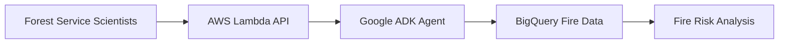

# 🏗️ GitHub Architecture Diagram Strategy
**For: RisenOne Fire Risk AI Multi-Agent System**

## 📋 **Repository Structure Recommendation**

```
risenone-fire-analysis-agent/
├── README.md                          # Main entry point with overview diagram
├── docs/
│   ├── architecture/
│   │   ├── README.md                  # Architecture index page
│   │   ├── multi-agent-system.md     # Detailed technical diagram
│   │   ├── integration-flow.md       # AWS-GCP integration
│   │   ├── data-sources.md           # Data flow specifics
│   │   └── diagrams/                 # Static diagram assets
│   │       ├── architecture-overview.svg
│   │       ├── multi-agent-detail.svg
│   │       └── integration-flow.svg
│   └── stakeholder/
│       ├── executive-summary.md       # Business-focused diagrams
│       └── technical-overview.md     # Developer-focused content
```

## 🎯 **Three-Tier Diagram Strategy**

### **Tier 1: Repository README.md (Overview)**
```markdown
# 🔥 RisenOne Fire Risk AI Platform

## System Architecture Overview


📊 **[View Detailed Architecture →](docs/architecture/README.md)**
```

### **Tier 2: Architecture Index (docs/architecture/README.md)**
```markdown
# 🏗️ System Architecture Documentation

## Architecture Components

| Component | Description | Diagram |
|-----------|-------------|---------|
| **Multi-Agent System** | Internal agent orchestration | [View Details](multi-agent-system.md) |
| **AWS-GCP Integration** | Platform integration flow | [View Details](integration-flow.md) |
| **Data Sources** | Data pipeline architecture | [View Details](data-sources.md) |

## Quick Reference


## Navigation
- 🎯 **[Multi-Agent System Details](multi-agent-system.md)** - Internal orchestration
- 🔗 **[Integration Flow](integration-flow.md)** - AWS-GCP connectivity  
- 📊 **[Data Sources](data-sources.md)** - BigQuery and external APIs
```

### **Tier 3: Detailed Technical (docs/architecture/multi-agent-system.md)**
```markdown
# 🧠 Multi-Agent System Architecture

## Executive Summary
The RisenOne Fire Risk AI system uses a sophisticated multi-agent architecture...

## Detailed System Flow

### Option A: Native Mermaid (if it renders properly)
```mermaid
[FULL COMPLEX DIAGRAM HERE]
```

### Option B: SVG Fallback (if Mermaid is too complex)


**💡 Interactive Version**: [View in Mermaid Live Editor](https://mermaid.live/edit#pako:eNpVkE1...)

## Component Details
[Detailed text explanations of each component]
```

## 🛠️ **Implementation Guide for Cursor Team**

### **Step 1: Create Mermaid Source Files**
```bash
# Create dedicated Mermaid files for version control
mkdir -p docs/architecture/mermaid-source/
```

**File: `docs/architecture/mermaid-source/multi-agent-system.mmd`**
```mermaid
[FULL MERMAID CODE HERE - VERSION CONTROLLED]
```

### **Step 2: Generate SVG Assets**
```bash
# Install Mermaid CLI
npm install -g @mermaid-js/mermaid-cli

# Generate SVG from Mermaid source
mmdc -i docs/architecture/mermaid-source/multi-agent-system.mmd \
     -o docs/architecture/diagrams/multi-agent-detail.svg \
     -t neutral \
     --width 1600 \
     --height 1200
```

### **Step 3: Create GitHub Action for Auto-Generation**
**File: `.github/workflows/generate-diagrams.yml`**
```yaml
name: Generate Architecture Diagrams
on:
  push:
    paths:
      - 'docs/architecture/mermaid-source/**'
  pull_request:
    paths:
      - 'docs/architecture/mermaid-source/**'

jobs:
  generate-diagrams:
    runs-on: ubuntu-latest
    steps:
      - uses: actions/checkout@v3
      
      - name: Setup Node.js
        uses: actions/setup-node@v3
        with:
          node-version: '18'
          
      - name: Install Mermaid CLI
        run: npm install -g @mermaid-js/mermaid-cli
        
      - name: Generate SVG diagrams
        run: |
          mmdc -i docs/architecture/mermaid-source/multi-agent-system.mmd \
               -o docs/architecture/diagrams/multi-agent-detail.svg \
               -t neutral --width 1600 --height 1200
               
      - name: Commit generated diagrams
        run: |
          git config --local user.email "action@github.com"
          git config --local user.name "GitHub Action"
          git add docs/architecture/diagrams/
          git diff --staged --quiet || git commit -m "Auto-generate architecture diagrams"
          git push
```

## 🎯 **Cursor Team Implementation Checklist**

### **Phase 1: Basic Setup (30 minutes)**
- [ ] Create `docs/architecture/` folder structure
- [ ] Move complex Mermaid diagram to dedicated `.mmd` file
- [ ] Create simplified overview diagram for main README
- [ ] Test GitHub rendering of simplified diagrams

### **Phase 2: Professional Setup (1 hour)**
- [ ] Install Mermaid CLI: `npm install -g @mermaid-js/mermaid-cli`
- [ ] Generate SVG versions of complex diagrams
- [ ] Create architecture index page with navigation
- [ ] Add diagram links and references

### **Phase 3: Automation (Optional - 1 hour)**
- [ ] Set up GitHub Action for auto-diagram generation
- [ ] Configure diagram themes and styling
- [ ] Add interactive Mermaid Live Editor links
- [ ] Test automated workflow

## 📐 **Diagram Size Guidelines**

| Diagram Type | Max Nodes | GitHub Rendering | Recommendation |
|--------------|-----------|------------------|----------------|
| **Overview** | 15-20 nodes | ✅ Renders well | Use in README |
| **Detailed** | 20-50 nodes | ⚠️ May timeout | Use SVG fallback |
| **Complex** | 50+ nodes | ❌ Often fails | Always use SVG |

## 🔗 **External Tool Integration**

### **Mermaid Live Editor Links**
```markdown
**🔧 Edit This Diagram**: [Mermaid Live Editor](https://mermaid.live/edit#pako:eNpVkE1...)
```

### **Lucidchart/Draw.io Integration**
```markdown
**📊 Interactive Version**: [View in Lucidchart](https://lucid.app/documents/view/...)
```

## 💡 **Pro Tips for Complex Diagrams**

### **1. Progressive Disclosure**
```markdown
## Architecture Overview
[Simple overview diagram]

### Detailed Components
- **[User Interface Layer](ui-layer.md)** - Frontend and API integration
- **[Multi-Agent System](multi-agent-system.md)** - AI orchestration (THIS PAGE)
- **[Data Pipeline](data-pipeline.md)** - BigQuery and external APIs
```

### **2. Clickable Image Maps**
```markdown
[](docs/architecture/README.md)
```

### **3. Multiple Format Options**
```markdown
## View Options
- 📱 **[Mobile-Friendly Version](mobile-architecture.md)**
- 🖥️ **[Desktop Interactive](desktop-architecture.html)**
- 📊 **[Stakeholder Summary](stakeholder-overview.md)**
```

## ⚡ **Quick Implementation Commands**

```bash
# 1. Create structure
mkdir -p docs/architecture/{diagrams,mermaid-source}

# 2. Generate SVG from Mermaid
mmdc -i input.mmd -o output.svg -t neutral --width 1600

# 3. Optimize SVG for GitHub
svgo docs/architecture/diagrams/*.svg

# 4. Test GitHub rendering
git add . && git commit -m "Add architecture diagrams" && git push
```

---

**🎯 Bottom Line**: Use **native Mermaid for simple diagrams** and **SVG files for complex ones**, with a **tiered documentation approach** that progressively reveals detail. This gives you GitHub native rendering for overviews and professional-quality assets for complex technical diagrams.