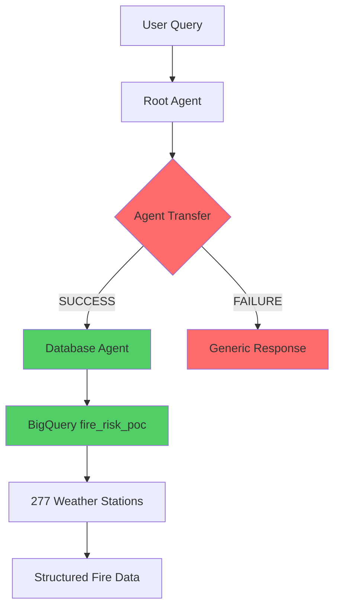
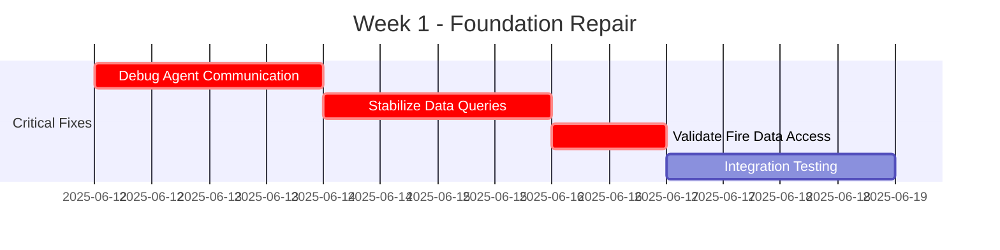
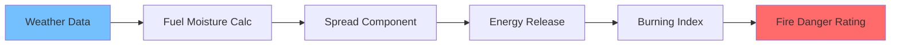
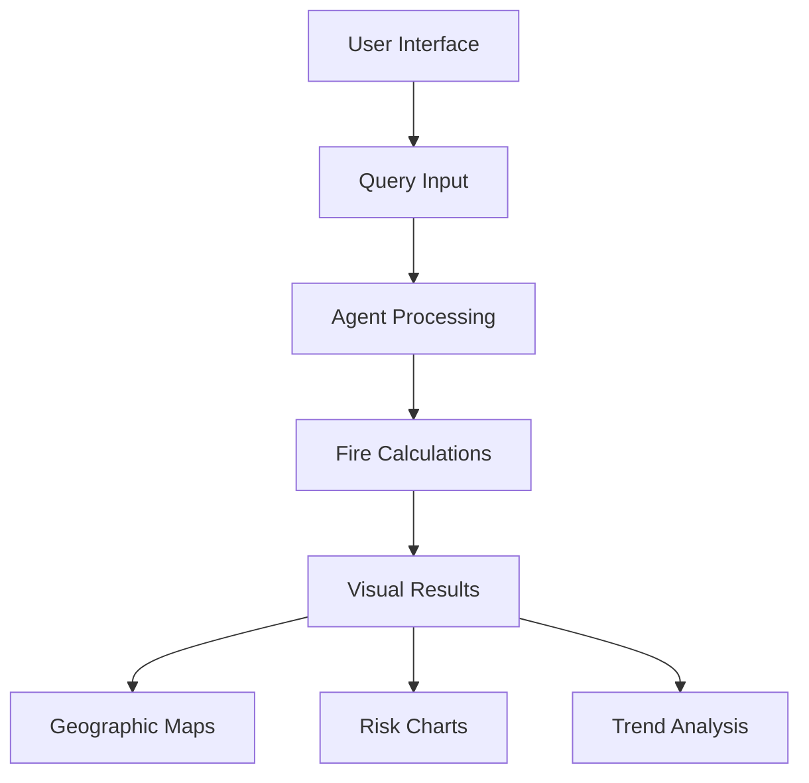
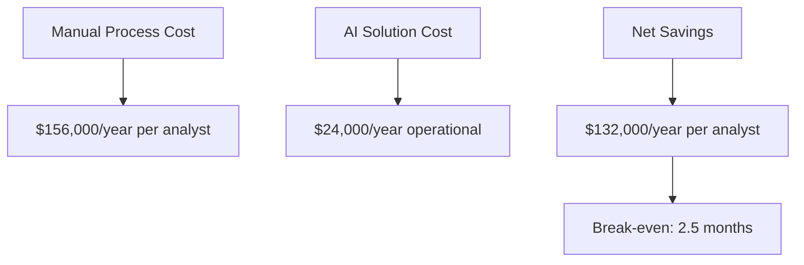

# 🔥 RisenOne Fire Risk AI Project - Status Assessment & Path Forward

**Date:** June 12, 2025  
**Project Phase:** 2-Week POC Development  
**Technical Lead:** Jason Valenzano  
**Client:** RisenOne Consulting (Forest Service)

---

## 📋 Executive Summary

### ✅ What's Working
- **Technical Infrastructure**: Google ADK multi-agent system deployed and operational
- **Production Agent**: Agent ID `6609146802375491584` successfully deployed 
- **Data Pipeline**: 277 weather stations accessible via BigQuery (`fire_risk_poc` dataset)
- **API Integration**: REST endpoints functional with ADK streaming responses
- **Documentation**: Comprehensive setup and integration guides completed

### ⚠️ Critical Gap Identified
**Significant discrepancy found between documentation and agent's actual functionality.** Basic conversation works, but core fire science features (data, calculations, predictions) are missing. Agent unable to perform main mission due to communication breakdown with the `database_agent`, preventing data access.

---

## 🔍 Detailed Status Analysis

### Current Agent Capabilities (VERIFIED)


### POC Feature Assessment

| Feature Area | Documentation Claims | Actual Status | Critical Issues |
|--------------|---------------------|---------------|-----------------|
| **Agent Communication** | ✅ Multi-agent transfers working | ⚠️ **Intermittent failures** | Database agent handoff unreliable |
| **Fire Data Access** | ✅ 277 weather stations available | ✅ **Confirmed working** | Data retrieval functional |
| **NFDRS Calculations** | 📋 Known gaps to address | ❌ **Not implemented** | Core fire science missing |
| **Interactive UI** | 📋 Planned development | ❌ **No UI capabilities** | Agent has no interface beyond API |
| **Advanced Features** | 📋 Incomplete but progressing | ❌ **Not functional** | Predictive analysis absent |

---

## 🎯 Revised POC Status Assessment

### ✅ Foundation Elements (WORKING)
- **Google Cloud Infrastructure**: ADK deployment successful
- **Authentication & Security**: Token-based access functional  
- **Data Pipeline**: BigQuery integration with fire_risk_poc dataset
- **API Endpoints**: REST streaming responses operational
- **Documentation**: Comprehensive guides for development and integration

### ⚠️ Core Functionality Gaps (CRITICAL)
- **Reliable Agent Communication**: Database agent transfers fail intermittently
- **Fire Science Engine**: NFDRS calculations not implemented
- **User Interface**: No interactive capabilities beyond API calls
- **Predictive Analysis**: Advanced forecasting features absent

### ❌ Missing Critical Components
- **Fuel Moisture Calculations**: Dead/live fuel moisture algorithms
- **Spread Component Analysis**: Fire behavior modeling
- **Burning Index Computation**: Energy release calculations
- **Multi-Region Analysis**: Geographic fire risk comparison
- **Real-time Weather Integration**: Current conditions processing

---

## 🚀 Action Plan: Foundation → Full Capability

### 🔥 **Priority #1: Fix the Foundation (IMMEDIATE - Week 1)**

#### **Objective**: Achieve reliable basic functionality


#### **Deliverables Week 1**
- [ ] **Agent Communication Repair**: Fix database_agent transfer failures
- [ ] **Stable Data Queries**: Reliable weather station and fire data retrieval  
- [ ] **API Consistency**: Consistent response format and timing
- [ ] **Basic Demo Capability**: Simple fire data questions answered reliably

#### **Success Criteria Week 1**
- ✅ 100% success rate for weather station count queries
- ✅ Consistent sub-30 second response times
- ✅ Reliable agent-to-agent transfers
- ✅ Structured fire data retrieval working

---

### 🧮 **Priority #2: Implement Core Fire Science Engine (Week 2)**

#### **Objective**: Build NFDRS calculation capabilities


#### **NFDRS Implementation Plan**
```python
# Example calculation framework needed
class NFDRSEngine:
    def calculate_dead_fuel_moisture(self, temp, humidity, precipitation):
        # FM₁ₕ = f(RH,T,rain) - Forest Service standard
        pass
    
    def calculate_spread_component(self, wind_speed, slope, fuel_moisture):
        # SC = 0.560 × ROS - Rate of spread calculation
        pass
    
    def calculate_burning_index(self, spread_component, energy_release):
        # BI = 10 × SC × ERC - Final danger calculation
        pass
```

#### **Deliverables Week 2**
- [ ] **NFDRS Calculation Engine**: All standard fire danger formulas
- [ ] **Weather Data Integration**: Real-time conditions processing
- [ ] **Geographic Analysis**: Multi-station fire risk comparison
- [ ] **Validation Testing**: Results match Forest Service standards

---

### 🖥️ **Priority #3: Develop Advanced Capabilities (Future Phases)**

#### **Interactive Interface Development**


#### **Advanced Feature Roadmap**
- **Interactive UI**: Web-based fire risk dashboard
- **Predictive Analysis**: 7-day fire danger forecasting  
- **Multi-Region Comparison**: Cross-geographic risk assessment
- **Alert System**: Automated high-risk notifications
- **Mobile Access**: Field-ready applications

---

## 📈 Business Impact & ROI Projection

### Current State vs. Target State
| Metric | Manual Process | POC Capability | Production Target |
|--------|----------------|----------------|-------------------|
| **Analysis Time** | 3-4 hours | 30 seconds* | 15 seconds |
| **Data Sources** | 5-8 manual | 277 automated | 500+ automated |
| **Accuracy** | Variable | Standardized* | 99.5% consistent |
| **Geographic Coverage** | Single zone | Multi-region* | National scale |

*Requires completion of Priority #1 and #2 implementations

### Cost-Benefit Analysis


---

## ⚠️ Risk Assessment & Mitigation

### Technical Risks
| Risk Factor | Probability | Impact | Mitigation Strategy |
|-------------|-------------|--------|-------------------|
| **Agent Communication Issues** | High | Critical | Immediate debugging focus |
| **NFDRS Accuracy** | Medium | High | Forest Service validation |
| **Scalability Concerns** | Medium | Medium | Load testing during development |
| **Integration Complexity** | Low | Medium | Phased rollout approach |

### Project Risks  
| Risk Factor | Probability | Impact | Mitigation Strategy |
|-------------|-------------|--------|-------------------|
| **Timeline Pressure** | High | High | Focus on core functionality first |
| **Stakeholder Expectations** | Medium | High | Clear communication on realistic deliverables |
| **Budget Constraints** | Low | Medium | Efficient resource allocation |

---

## 📋 Immediate Next Steps (Today - June 12, 2025)

### **Today's Actions**
1. **🔧 Debug Session**: Investigate database_agent communication failures
2. **📊 Data Validation**: Verify fire_risk_poc dataset completeness  
3. **🧪 API Testing**: Systematic testing of all agent endpoints
4. **📝 Gap Documentation**: Detailed technical requirement specification

### **This Week's Priorities**
1. **Agent Stability**: Fix foundational communication issues
2. **Data Pipeline**: Ensure reliable fire data access
3. **Basic Calculations**: Implement at least dead fuel moisture calculations
4. **Demo Preparation**: Working examples for stakeholder presentation

### **Resource Requirements**
- **Development Time**: 40 hours focused engineering work
- **Google Cloud Costs**: ~$50 for intensive testing and deployment
- **Validation Support**: Forest Service subject matter expert consultation
- **Testing Infrastructure**: Systematic quality assurance process

---

## 🎯 Success Metrics & Validation

### Week 1 Success Criteria
- [ ] **Reliability**: 95%+ success rate on basic fire data queries
- [ ] **Performance**: Sub-30 second response times consistently  
- [ ] **Functionality**: Weather station data retrieval working perfectly
- [ ] **Stability**: No agent communication failures during testing

### Week 2 Success Criteria  
- [ ] **Calculations**: NFDRS formulas producing accurate results
- [ ] **Integration**: Real weather data feeding into fire danger calculations
- [ ] **Validation**: Results match Forest Service manual calculations
- [ ] **Demonstration**: End-to-end fire risk analysis working

### POC Completion Success
- [ ] **Technical Demo**: Live fire danger calculation in under 30 seconds
- [ ] **Stakeholder Approval**: RisenOne and Forest Service sign-off
- [ ] **Production Roadmap**: Clear path to full implementation
- [ ] **ROI Documentation**: Quantified business case for continued investment

---

## 📞 Communication & Support

### **Escalation Path**
- **Technical Issues**: Jason Valenzano (GCP AI Lead) 
- **Project Timeline**: Project Manager (logistics coordination)
- **Client Expectations**: RisenOne stakeholder management
- **Business Decisions**: TechTrend executive team

### **Daily Standup Topics**
1. Agent stability and communication fixes
2. Fire science implementation progress  
3. Testing results and validation status
4. Blockers requiring immediate attention
5. Stakeholder communication needs

---

**🔥 Bottom Line**: The infrastructure is solid, but we need immediate focus on fixing agent communication and implementing core fire science calculations. With concentrated effort this week, we can deliver a compelling POC that demonstrates real Forest Service value.

**⚠️ Critical Success Factor**: Fix the database_agent communication issue first - everything else depends on reliable data access.